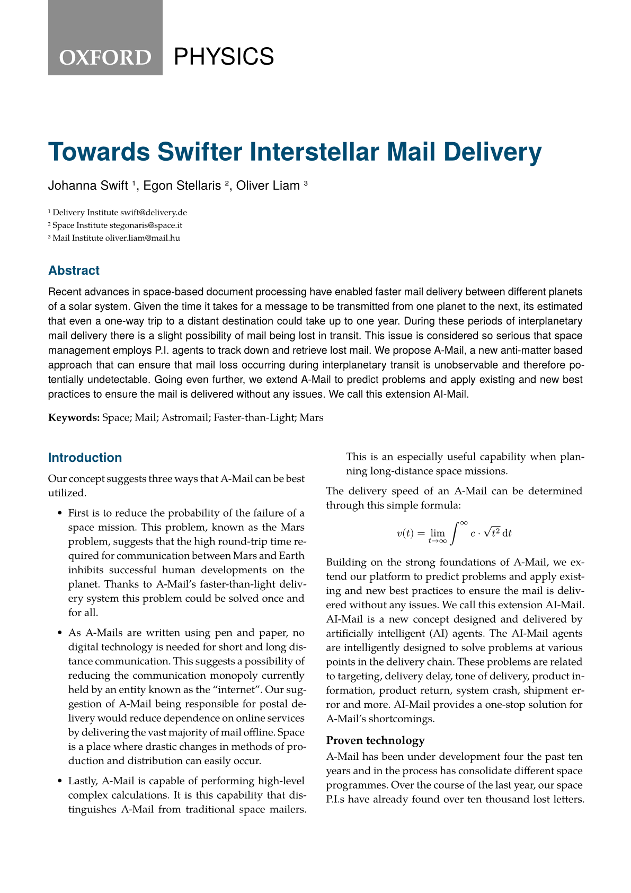
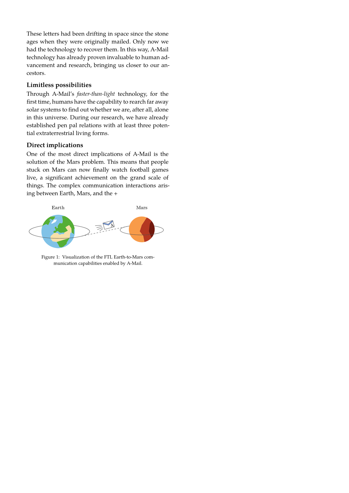

# The `my-package` Package
<div align="center">Version 0.1.0</div>

A short description about the project and/or client.

## Template adaptation checklist

- [ ] Fill out `README.md`
  - Change the `my-package` package name, including code snippets
  - Check section contents and/or delete sections that don't apply
- [ ] Check and/or replace `LICENSE` by something that suits your needs
- [ ] Fill out `typst.toml`
  - See also the [typst/packages README](https://github.com/typst/packages/?tab=readme-ov-file#package-format)
- [ ] Adapt Repository URLs in `CHANGELOG.md`
  - Consider only committing that file with your first release, or removing the "Initial Release" part in the beginning
- [ ] Adapt or deactivate the release workflow in `.github/workflows/release.yml`
  - to deactivate it, delete that file or remove/comment out lines 2-4 (`on:` and following)
  - to use the workflow
    - [ ] check the values under `env:`, particularly `REGISTRY_REPO`
    - [ ] if you don't have one, [create a fine-grained personal access token](https://github.com/settings/tokens?type=beta) with [only Contents permission](https://stackoverflow.com/a/75116350/371191) for the `REGISTRY_REPO`
    - [ ] on this repo, create a secret `REGISTRY_TOKEN` (at `https://github.com/[user]/[repo]/settings/secrets/actions`) that contains the so created token

    if configured correctly, whenever you create a tag `v...`, your package will be pushed onto a branch on the `REGISTRY_REPO`, from which you can then create a pull request against [typst/packages](https://github.com/typst/packages/)
- [ ] remove/replace the example test case
- [ ] (add your actual code, docs and tests)
- [ ] remove this section from the README

## Getting Started

To use this template, simply import it as shown below:

```typ
#import "@preview/graceful-genetics:0.1.0"

#show: graceful-genetics.template.with(
  title: [Towards Swifter Interstellar Mail Delivery],
  authors: (
    (
      name: "Johanna Swift",
      department: "Primary Logistics Department",
      institution: "Delivery Institute",
      city: "Berlin",
      country: "Germany",
      mail: "swift@delivery.de",
    ),
    (
      name: "Egon Stellaris",
      department: "Communications Group",
      institution: "Space Institute",
      city: "Florence",
      country: "Italy",
      mail: "stegonaris@space.it",
    ),
    (
      name: "Oliver Liam",
      department: "Missing Letters Task Force",
      institution: "Mail Institute",
      city: "Budapest",
      country: "Hungary",
      mail: "oliver.liam@mail.hu",
    ),
  ),
  date: (
    year: 2022,
    month: "May",
    day: 17,
  ),
  keywords: (
    "Space",
    "Mail",
    "Astromail",
    "Faster-than-Light",
    "Mars",
  ),
  doi: "10:7891/120948510",
  abstract: [
    Recent advances in space-based document processing have enabled faster mail delivery between different planets of a solar system. Given the time it takes for a message to be transmitted from one planet to the next, its estimated that even a one-way trip to a distant destination could take up to one year. During these periods of interplanetary mail delivery there is a slight possibility of mail being lost in transit. This issue is considered so serious that space management employs P.I. agents to track down and retrieve lost mail. We propose A-Mail, a new anti-matter based approach that can ensure that mail loss occurring during interplanetary transit is unobservable and therefore potentially undetectable. Going even further, we extend A-Mail to predict problems and apply existing and new best practices to ensure the mail is delivered without any issues. We call this extension AI-Mail.
  ]
)
```

## Usage

A more in-depth description of usage. Any template arguments? A complicated example that showcases most if not all of the functions the package provides? This is also an excellent place to signpost the manual.

```typ
#import "@preview/my-package:0.1.0": *

#let my-complicated-example = ...
```

## Media

<p align="center">
  
&nbsp; &nbsp; &nbsp; &nbsp;
  
</p>